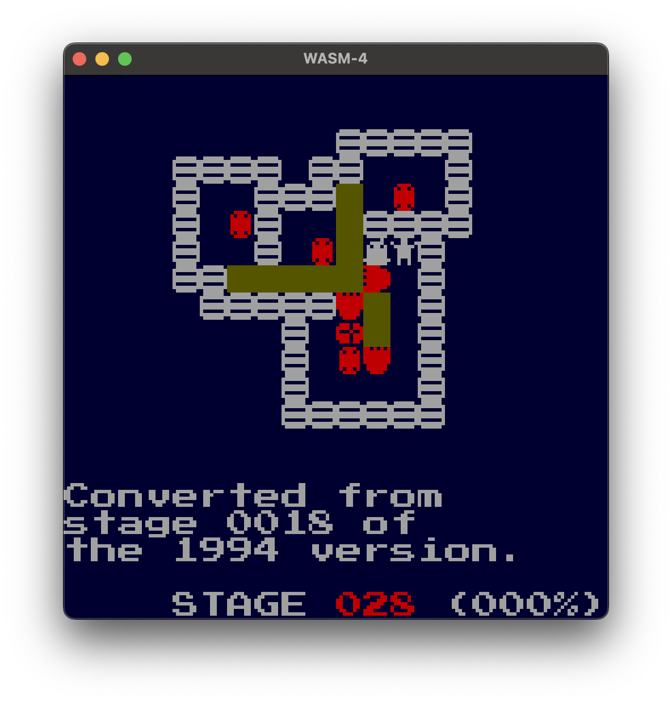

# Lad 2024

A puzzle game for the [WASM-4] fantasy console.

[WASM-4]: https://wasm4.org

## How to play

Maybe it's simplest to run it on your browser.

* [On wasm4.org]

* An alternative hosting [on my GitHub pages]

* [A development snapshot] for testing

[On wasm4.org]: https://wasm4.org/play/lad2024

[on my GitHub pages]: https://yamt.github.io/lad2024/

[A development snapshot]: https://yamt.github.io/lad2024/snapshot

### Operations

| Gamepad button             | Operation
| -------------------------- | ---------------------------
| `UP` `DOWN` `RIGHT` `LEFT` | Move the current player
| `X`                        | Toggle players
| `Z` + `UP`                 | Give up and reset the stage
| `Z` + `DOWN`               | Undo a move
| `Z` + `RIGHT`              | Move to the next stage
| `Z` + `LEFT`               | Move to the previous stage

### Save data

The game progress is automatically saved and restored.

## History

In 1994, I've written [the original version] of this game.
It was in x86 assembler for the NEC PC-9800 series.

In 2024, I found it in one of my MO disks and ported it
to the [WASM-4] fantasy console.

[the original version]: https://github.com/yamt/lad1994

## Messages to myself in 1994

* Please write comments.

* Please document your domain-specific compression format
  for the stage data.

* I couldn't even figure out what "LAD" stands for.
